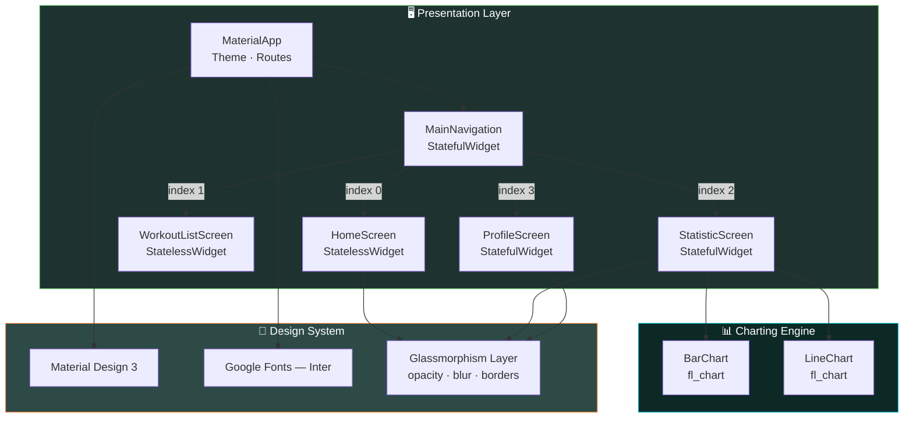
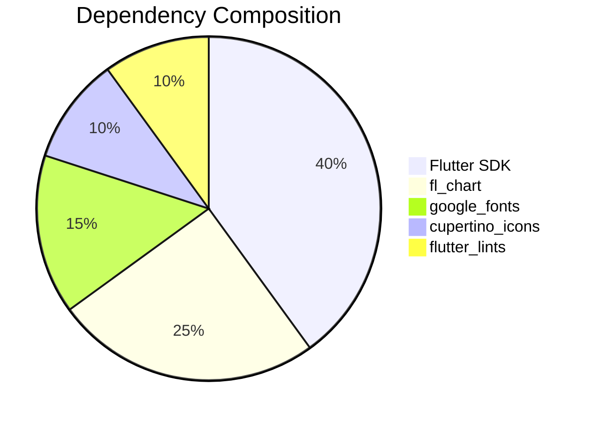
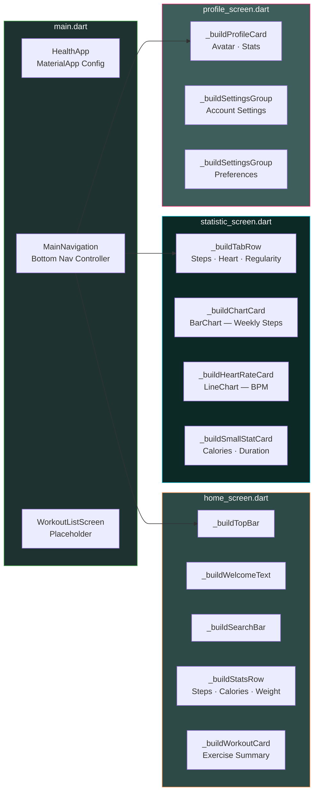
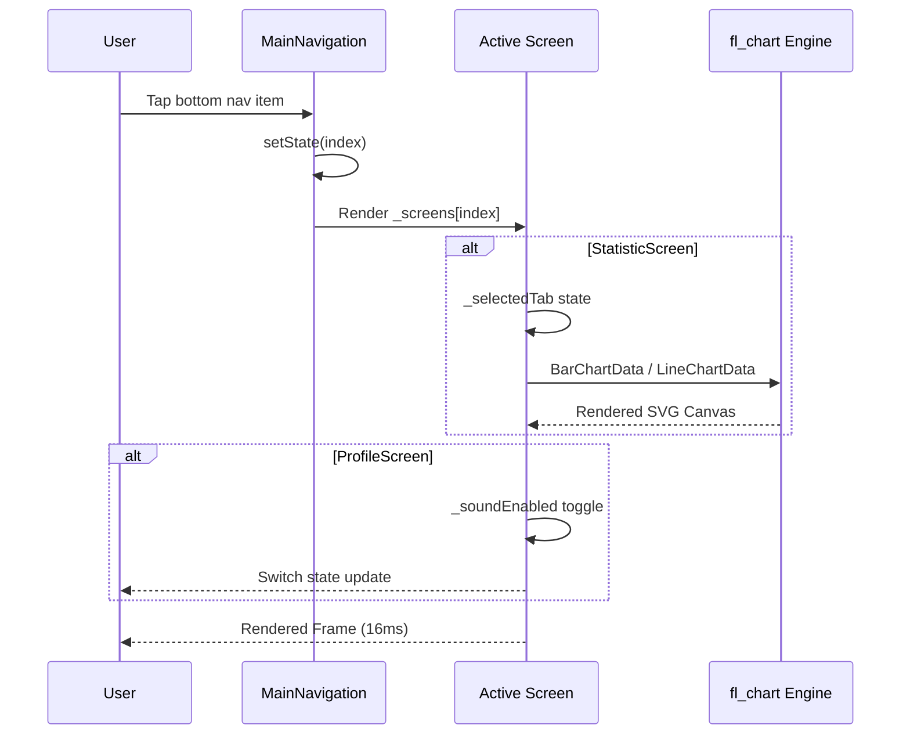
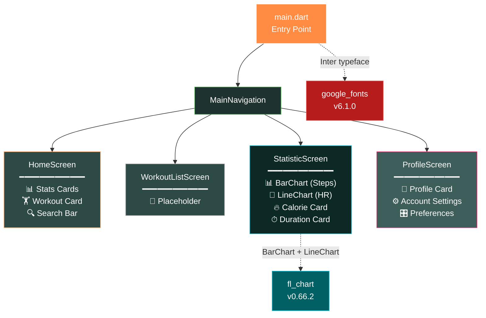
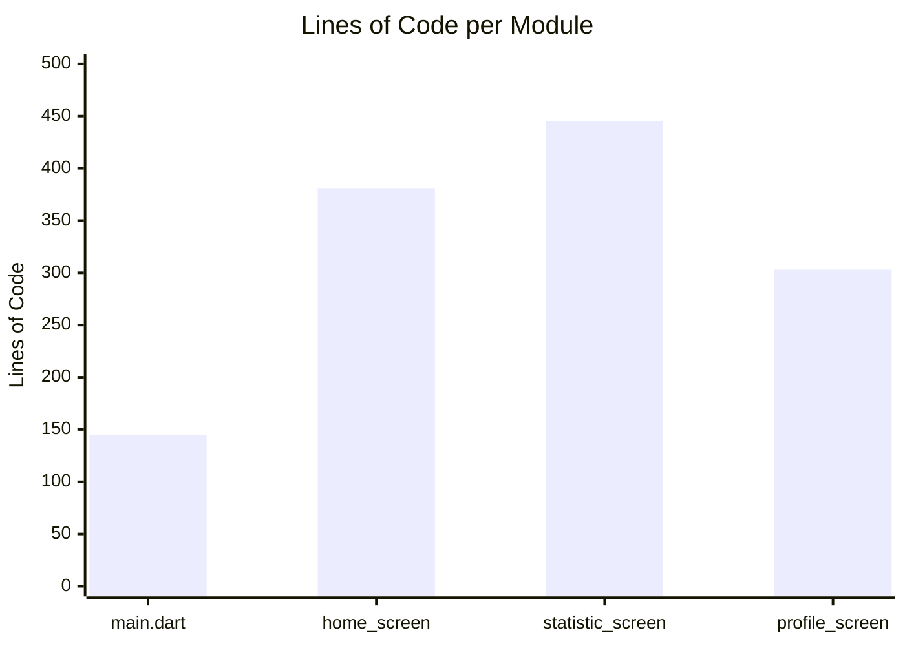
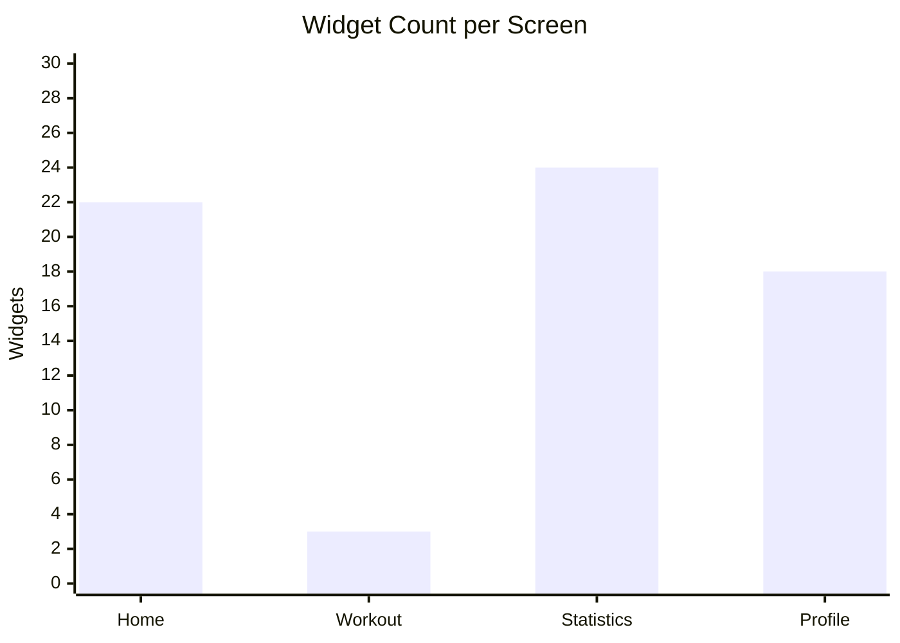
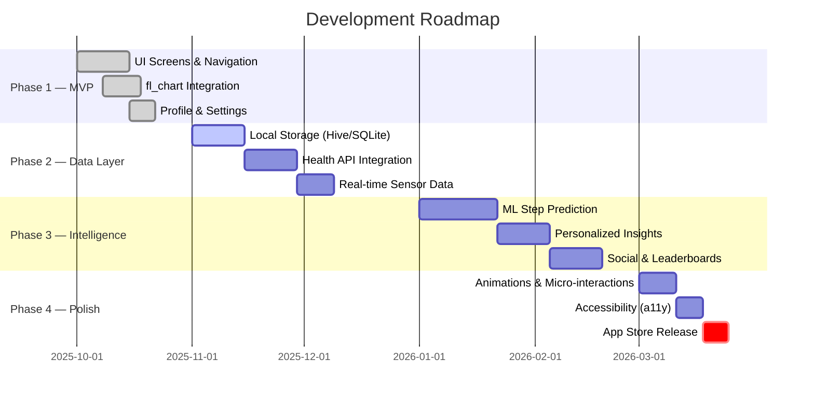

<p align="center">
  
  
  
  
  
</p>

<h1 align="center">
  🏥 HealthPulse
</h1>

<p align="center">
  <strong>A premium, data-driven Health & Fitness Tracker built with Flutter & Material Design 3</strong>
</p>

<p align="center">
  
  
  
  
  
</p>

---

## 📋 Table of Contents

- [Overview](#-overview)
- [Architecture](#-architecture)
- [Tech Stack](#-tech-stack)
- [Module Breakdown](#-module-breakdown)
- [Data Flow](#-data-flow)
- [Screen Dependency Graph](#-screen-dependency-graph)
- [Widget Composition Tree](#-widget-composition-tree)
- [Performance Metrics](#-performance-metrics)
- [Getting Started](#-getting-started)
- [Project Structure](#-project-structure)
- [Roadmap](#-roadmap)

---

## 🔭 Overview

**HealthPulse** is a cross-platform health & fitness tracking application designed with a focus on immersive dark-teal UI, real-time data visualization via `fl_chart`, and a buttery-smooth navigation experience. It tracks steps, calories, heart rate, workout duration, and user profile metrics — all wrapped in a modern glassmorphism-inspired design.

---

## 🏗 Architecture



---

## ⚙️ Tech Stack



| Layer | Technology | Purpose |
|-------|-----------|---------|
| **Framework** | Flutter 3.x / Dart ≥3.0 | Cross-platform UI toolkit |
| **Theming** | Material Design 3 | Adaptive design tokens |
| **Typography** | Google Fonts (`Inter`) | Premium typeface |
| **Charts** | `fl_chart ^0.66.2` | Bar charts, line charts, touch interactions |
| **Icons** | `cupertino_icons ^1.0.2` | iOS-style icon set |
| **Linting** | `flutter_lints ^3.0.0` | Static analysis & code quality |

---

## 📦 Module Breakdown



---

## 🔄 Data Flow



---

## 🕸 Screen Dependency Graph



---

## 🌳 Widget Composition Tree

```mermaid
graph TD
    MA[MaterialApp] --> MN[MainNavigation]
    MN --> SC[Scaffold]
    SC --> BODY["_screens&#91;index&#93;"]
    SC --> BNB[BottomNavigationBar<br/>Custom AnimatedContainer]

    BODY --> HS[HomeScreen]
    BODY --> SS[StatisticScreen]
    BODY --> PS[ProfileScreen]

    HS --> TB[TopBar<br/>Logo · Icons · Avatar]
    HS --> WT[WelcomeText<br/>RichText]
    HS --> SB[SearchBar<br/>Glassmorphic Input]
    HS --> SR[StatsRow<br/>Horizontal ListView]
    SR --> SC1["StatCard<br/>Steps: 5400<br/>⬤ 54%"]
    SR --> SC2["StatCard<br/>Calories: 312<br/>⬤ 62%"]
    SR --> SC3["StatCard<br/>Weight: 312<br/>⬤ 70%"]
    HS --> WC[WorkoutCard<br/>Upper Body · 16 ex]

    SS --> TAB[TabRow<br/>Steps · Heart · Regularity]
    SS --> CHART[ChartCard<br/>BarChart · 7 days]
    SS --> GRID[WorkoutGrid]
    GRID --> HRC["HeartRateCard<br/>LineChart · 120 BPM"]
    GRID --> CAL["CaloriesCard<br/>143 kcal"]
    GRID --> DUR["DurationCard<br/>130 min"]

    PS --> PC[ProfileCard<br/>Avatar · Name · Location]
    PS --> AS[AccountSettings<br/>3 items]
    PS --> PR[Preferences<br/>2 items]

    style MA fill:#FF8C42,stroke:#fff,color:#fff
    style HS fill:#2D4A47,stroke:#FF8C42,color:#fff
    style SS fill:#0D2926,stroke:#00BCD4,color:#fff
    style PS fill:#3D5E5A,stroke:#E91E63,color:#fff
```



---

## 📈 Performance Metrics





### Codebase Statistics

| Metric | Value |
|--------|-------|
| **Total Dart Files** | 5 |
| **Total Lines of Code** | ~1,274 |
| **Screens** | 4 (Home, Workout, Statistics, Profile) |
| **StatefulWidgets** | 3 |
| **StatelessWidgets** | 3 |
| **Chart Instances** | 2 (BarChart + LineChart) |
| **Custom Widget Builders** | 18 |
| **Animation Controllers** | 4 (AnimatedContainer transitions) |
| **Color Palette Size** | 8 primary tokens |

---

## 🚀 Getting Started

### Prerequisites

```
Flutter SDK ≥ 3.0.0
Dart SDK ≥ 3.0.0
```

### Installation

```bash
# Clone the repository
git clone https://github.com/SahilParbale/startup1.git
cd startup1

# Install dependencies
flutter pub get

# Run on connected device / emulator
flutter run
```

### Build Targets

```bash
# Android APK
flutter build apk --release

# iOS (macOS only)
flutter build ios --release

# Web
flutter build web --release
```

---

## 📂 Project Structure

```
health_app/
├── lib/
│   ├── main.dart                  # App entry, theme, navigation shell
│   └── screens/
│       ├── home_screen.dart       # Dashboard — stats, workout cards
│       ├── statistic_screen.dart  # Charts — bar (steps), line (HR)
│       └── profile_screen.dart    # User profile & settings
├── pubspec.yaml                   # Dependencies & metadata
├── .gitignore                     # Flutter-standard ignores
└── README.md                      # ← You are here
```

---

## 🗺 Roadmap



---

## 🎨 Design System

| Token | Hex | Usage |
|-------|-----|-------|
| `bg-primary` | `#2D4A47` | Scaffold background |
| `bg-deep` | `#1E3330` | Bottom nav, card accents |
| `bg-surface` | `#3D5E5A` | Gradient start, profile |
| `accent-orange` | `#FF8C42` | Step progress ring |
| `accent-red` | `#FF5722` | Calorie progress ring |
| `accent-green` | `#4CAF50` | Weight progress ring |
| `accent-teal` | `tealAccent` | Heart rate chart line |
| `text-primary` | `#FFFFFF` | Headings, values |
| `text-secondary` | `rgba(255,255,255,0.6)` | Labels, subtitles |
| `glassmorphism` | `rgba(255,255,255,0.12)` | Card backgrounds |

---

<p align="center">
  
  
</p>

<p align="center">
  <sub>Built with ❤️ using Flutter & Dart</sub>
</p>
